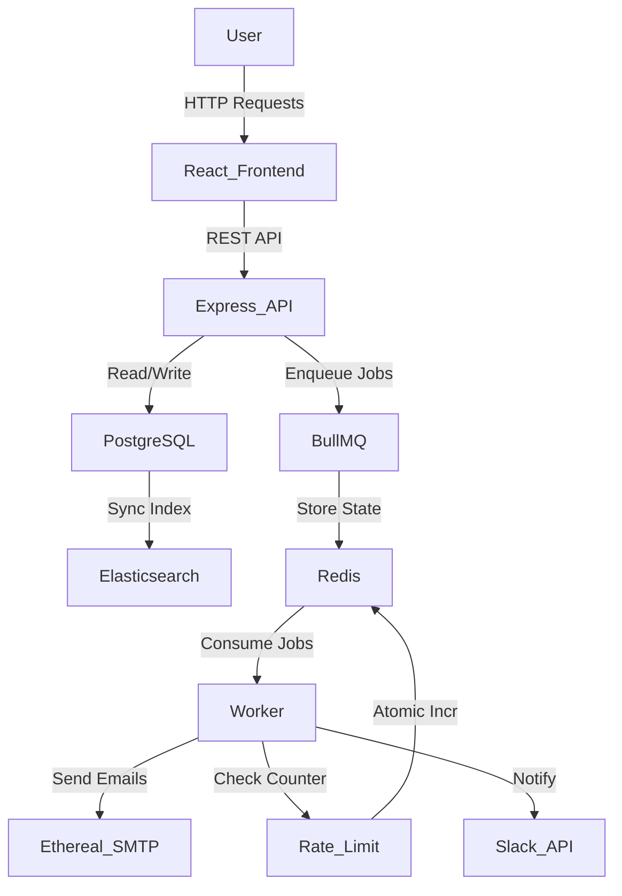
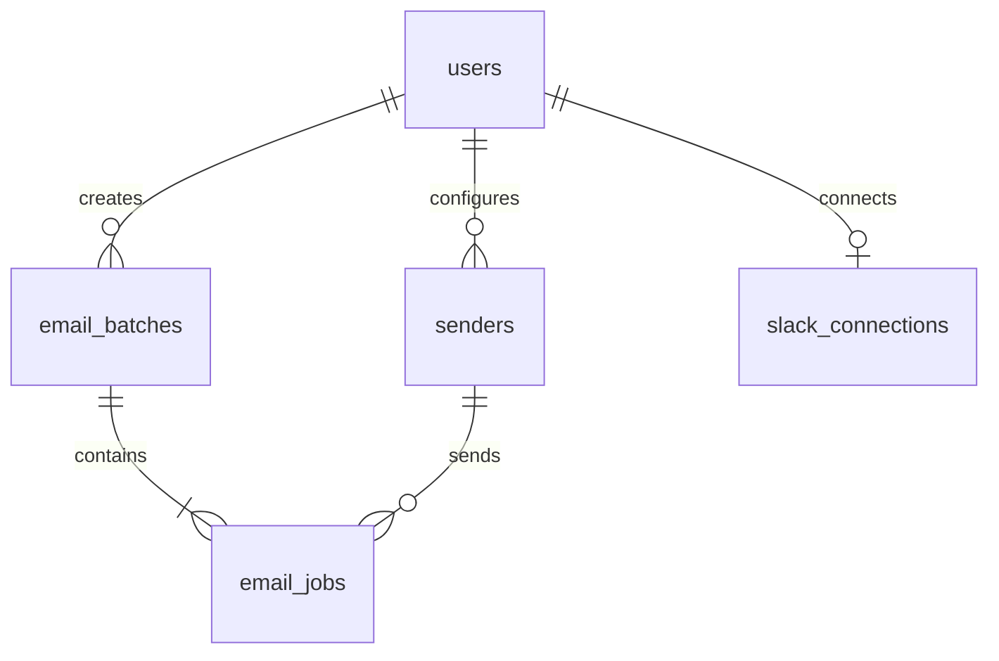

# MailPilot

MailPilot is a full-stack email job scheduling and delivery platform built with React, TypeScript, Express, PostgreSQL, BullMQ, Redis, Elasticsearch, and Ethereal SMTP.

---

## Overview

MailPilot enables users to efficiently schedule and deliver email campaigns asynchronously. 

- **BullMQ**: Chosen as the robust, Redis-backed job queue to handle delayed processing, retries, and rate limiting natively.
- **PostgreSQL**: Serves as the primary source of truth, storing users, batches, individual email jobs, and their statuses with ACID guarantees.
- **Redis**: Powers BullMQ queues and maintains fast, atomic in-memory counters for distributed rate limiting.
- **Elasticsearch**: Acts as a secondary index allowing ultra-fast full-text search across recipients, subjects, and email bodies without querying the primary database.
- **Separate Worker**: Background email processing is decoupled from the main API process. This ensures the API remains highly responsive for user interactions while the worker securely processes heavy SMTP interactions asynchronously.
- **Frontend-Backend Communication**: The React frontend communicates with the Express backend via RESTful APIs, authenticated securely using HTTP-only cookies.

---

## Features

### Authentication
- Google OAuth integration
- Protected routes
- HTTP-only authentication cookie
- Secure logout mechanism
- User profile fetching

### Email Scheduling
- Compose email (with HTML support)
- File attachments (Base64 encoded JSONB storage)
- CSV/TXT upload for lead generation
- Email extraction and duplicate removal
- Configurable start time
- Configurable delay between consecutive emails
- Hourly sending limits
- Scheduled email tracking via dashboard

### Queue Processing
- BullMQ integration
- Redis-backed job state
- Delayed jobs implementation
- Dedicated worker process
- Configurable concurrency
- Idempotent processing via atomic PostgreSQL updates

### Rate Limiting
- Redis-backed counters
- Per-sender rate limiting
- Configurable hourly limit 
- Automatic job rescheduling upon limit breach
- Slack notification upon reaching limits

### Search
- Elasticsearch indexing
- Full-text search by recipient, subject, body, and status

### Monitoring
- Bull Board integration
- Real-time queue states (Waiting, Delayed, Active, Completed, Failed)
- Loading, error, and empty states in the UI

---

## Tech Stack

| Technology | Purpose |
|---|---|
| **React** | Frontend library for building the UI |
| **TypeScript** | Static typing for both frontend and backend |
| **Vite** | Fast frontend build tool and development server |
| **Tailwind CSS** | Utility-first CSS framework for styling |
| **Express** | Backend web framework |
| **Node.js** | JavaScript runtime environment |
| **PostgreSQL** | Primary relational database |
| **Knex** | SQL query builder for PostgreSQL |
| **BullMQ** | Message queue for delayed jobs and scheduling |
| **Redis** | In-memory data store for queues and rate-limit counters |
| **ioredis** | Redis client for Node.js |
| **Nodemailer** | Module for sending emails |
| **Ethereal** | Fake SMTP service for testing and previewing |
| **Google OAuth** | Authentication provider |
| **Slack OAuth** | Authentication for Slack notifications |
| **Elasticsearch** | Full-text search engine |
| **Bull Board** | UI dashboard for monitoring BullMQ |
| **Neon** | Serverless PostgreSQL provider |
| **Upstash** | Serverless Redis provider |
| **Vercel** | Frontend deployment platform |
| **Render** | Backend API & Worker deployment platform |

---

## Architecture



---

## Email Scheduling Flow

1. User logs in via Google OAuth.
2. User uploads a CSV/TXT or manually enters emails.
3. Frontend extracts and deduplicates email addresses.
4. User enters subject, body, attachments, start time, delay, and hourly limit.
5. Frontend calls `POST /api/emails`.
6. Backend validates the request using Zod.
7. An `email_batches` record is created.
8. Individual `email_jobs` records are created for each recipient.
9. `scheduled_at` is calculated based on start time and the configured delay sequence.
10. BullMQ delayed jobs are created with the computed delay.
11. Redis stores the queue state.
12. The worker receives jobs exactly when they become available.
13. The worker checks idempotency via an atomic database update.
14. The worker checks the Redis rate limit counter.
15. The worker sends the email through Ethereal SMTP (along with any attachments).
16. PostgreSQL status is updated to `SENT`.
17. Elasticsearch is updated with the latest status.

---

## Why BullMQ?

The application intentionally **does not use cron jobs.** 

Instead, it relies on BullMQ's delayed jobs feature. A cron-based scheduler typically involves polling the database every minute, which doesn't scale well and can cause race conditions or missed executions. BullMQ provides:
- **Persistent queue**: Jobs are stored in Redis safely.
- **Delayed jobs**: Jobs are precisely scheduled for a timestamp and held in a delayed set.
- **Worker processing**: Dedicated processes efficiently consume jobs as they activate.
- **Redis-backed state**: Fast and memory-efficient.
- **Asynchronous processing**: Ensures the API isn't blocked.
- **Restart behavior**: If the server crashes, uncompleted jobs remain safely in Redis.

---

## Restart Recovery

Consider this scheduling scenario:
- Email A → 10:05
- Email B → 10:10
- Email C → 10:15

If the worker stops at 10:02 and restarts at 10:12:
- BullMQ and Redis still contain the delayed and active jobs.
- The worker instantly resumes processing Email A and Email B because their delay timestamps have passed, and then naturally waits for Email C.
- The application does not blindly recreate every database job during startup because BullMQ reliably persists the pending workload in Redis.

---

## Database Design

### `users`
| Field | Type |
|---|---|
| id | UUID (PK) |
| google_id | String |
| name | String |
| email | String |
| avatar_url | String |
| created_at | Timestamp |
| updated_at | Timestamp |

### `email_batches`
| Field | Type |
|---|---|
| id | UUID (PK) |
| user_id | UUID (FK) |
| subject | String |
| body | Text |
| attachments | JSONB |
| start_time | Timestamp |
| delay_between_ms | Integer |
| hourly_limit | Integer |
| created_at | Timestamp |
| updated_at | Timestamp |

### `senders`
| Field | Type |
|---|---|
| id | UUID (PK) |
| user_id | UUID (FK) |
| email | String |
| ethereal_user | String |
| ethereal_password | String |
| created_at | Timestamp |
| updated_at | Timestamp |

### `email_jobs`
| Field | Type |
|---|---|
| id | UUID (PK) |
| batch_id | UUID (FK) |
| user_id | UUID (FK) |
| sender_id | UUID (FK) |
| recipient | String |
| subject | String |
| body | Text |
| attachments | JSONB |
| scheduled_at | Timestamp |
| sent_at | Timestamp |
| status | Enum (SCHEDULED, PROCESSING, SENT, FAILED) |
| attempts | Integer |
| bull_job_id | String |
| message_id | String |
| preview_url | String |
| last_error | String |
| is_favourited | Boolean |
| created_at | Timestamp |
| updated_at | Timestamp |

### `slack_connections`
| Field | Type |
|---|---|
| id | UUID (PK) |
| user_id | UUID (FK) |
| team_id | String |
| team_name | String |
| access_token | String |
| channel_id | String |
| created_at | Timestamp |
| updated_at | Timestamp |

### Relationship Diagram


---

## Worker Architecture

The API and worker are entirely separate processes.
- **API**: Handles incoming HTTP requests and enqueues jobs (e.g. `npm run dev`).
- **Worker**: Processes background email jobs from BullMQ (e.g. `npm run worker`).

The configuration `WORKER_CONCURRENCY` determines how many jobs a single worker process can handle simultaneously. It strictly handles execution parallelism and is completely separate from the business logic of rate limiting.

---

## Concurrency

`WORKER_CONCURRENCY=5` means the worker can pick up and process up to 5 jobs concurrently from the queue.

It does **not** control the email sending rate.
- **Concurrency**: How many jobs the CPU works on at the exact same moment.
- **Delay**: The scheduled gap between two emails (e.g. 2 seconds).
- **Hourly Rate Limit**: The strict maximum cap of emails allowed per hour per sender.

---

## Minimum Email Delay

The system enforces a minimum threshold:
`MIN_EMAIL_DELAY_MS=2000`

If a batch is scheduled with this delay:
- 10:00:00 → Email A
- 10:00:02 → Email B
- 10:00:04 → Email C
- 10:00:06 → Email D

While the jobs are scheduled 2 seconds apart in Redis, the actual SMTP throughput depends on network latency and `WORKER_CONCURRENCY`. If Ethereal takes 3 seconds to respond, concurrent workers ensure the queue continues processing without blocking the pipeline.

---

## Rate Limiting

The application uses Redis-backed counters to enforce `MAX_EMAILS_PER_HOUR=200`.

The Redis key is structured as:
`email-rate:batch:{batchId}:{hourWindow}`

In-memory (RAM) counters inside the Node.js process are insufficient because they reset on server restarts and cannot be shared across horizontally scaled worker instances. Redis allows multiple worker instances to query and increment the shared rate limit atomically.

---

## Rate Limit Rescheduling

If the hourly limit is reached during processing:
- The email is **NOT** dropped.
- The email is **NOT** permanently failed.
- The worker automatically calculates the next available hour.
- The database `scheduled_at` time is updated.
- The BullMQ job is moved to the delayed state for the next hour.
- A Slack notification is fired to alert the user.

**Example**: (Limit = 2/hour)
- Email A → SENT
- Email B → SENT
- Email C → Rescheduled to next hour
- Email D → Rescheduled to next hour
- Email E → Rescheduled to next hour

---

## Multiple Senders

Rate limits are maintained on a specific boundary (batch or sender ID). This means:
- Sender A → Operates against its own Redis counter.
- Sender B → Operates against its own Redis counter.
- Sender C → Operates against its own Redis counter.

A limit breach on Sender A does not penalize Sender B.

---

## Idempotency

Jobs transition through specific states:
`SCHEDULED` → `PROCESSING` → `SENT` (or `FAILED`)

To prevent duplicate execution (e.g. if a worker crashes and restarts, or if two workers try to claim the same job), the system uses an atomic PostgreSQL claim:

```sql
UPDATE email_jobs
SET status = 'PROCESSING',
    attempts = attempts + 1
WHERE id = ?
AND status = 'SCHEDULED';
```

If no row is updated, it means another worker already claimed it, and the current worker gracefully aborts. 

*Trade-off*: While idempotency is guaranteed for database claims, there is a known theoretical failure boundary in distributed systems between the SMTP server successfully sending the email and the database successfully saving the `SENT` status (e.g. if the Node process is killed a millisecond after the SMTP success response). This application accepts this trade-off rather than falsely claiming exactly-once protocol delivery.

---

## Retry Strategy

BullMQ handles internal retries for temporary failures (like network timeouts):
- **Maximum attempts**: Configurable via BullMQ options.
- **Backoff**: Delayed backoff for retry attempts.
- **Permanent failures**: If max attempts are exceeded, the job is moved to the Failed queue and marked as `FAILED` in the database.

---

## Ethereal Email

Ethereal is a fake SMTP service designed for testing. 

**Flow**:
Worker → Nodemailer → Ethereal SMTP → Returns `messageId` / `previewUrl` → PostgreSQL stores the preview URL.

When viewing sent emails in the dashboard, you can click the Ethereal Preview URL to see exactly what the recipient would have received.

---

## Elasticsearch

While PostgreSQL acts as the source of truth, Elasticsearch acts as an ultra-fast secondary search layer.

**Indexed Fields**: `id`, `userId`, `recipient`, `subject`, `body`, `status`, `scheduledAt`, `sentAt`, `createdAt`.

**Endpoint**:
`GET /api/emails/search?q=`

If Elasticsearch is temporarily unavailable, it gracefully logs an error. Email delivery must **not** be marked as failed solely because the search indexing operation failed.

---

## Google OAuth

Authentication flow:
Frontend → Backend → Google → OAuth callback → Create/find user → Set HTTP-Only Cookie → Redirect to Dashboard

**Endpoints**:
- `GET /api/auth/google`
- `GET /api/auth/google/callback`
- `GET /api/auth/me`
- `POST /api/auth/logout`

---

## Slack OAuth

Integration flow:
Connect Slack → Slack OAuth → Callback → Store connection → On Rate limit event → Slack API sends notification to channel

**Endpoints**:
- `GET /api/slack/connect`
- `GET /api/slack/callback`
- `GET /api/slack/status`
- `DELETE /api/slack/disconnect`

If Slack is not connected, the worker simply skips the notification step without failing the email job.

---

## Bull Board

Available at: `/admin/queues`

Bull Board provides a visual dashboard to monitor the internal state of BullMQ:
- **Waiting**: Jobs ready to be processed.
- **Delayed**: Jobs scheduled for the future.
- **Active**: Jobs currently being processed.
- **Completed**: Jobs successfully finished.
- **Failed**: Jobs that threw an error.

This is essential for debugging and monitoring queue health.

---

## API Documentation

| Method | Endpoint | Authentication | Purpose |
|---|---|---|---|
| GET | `/health` | None | System health check |
| GET | `/api/auth/google` | None | Initiates Google OAuth |
| GET | `/api/auth/google/callback` | None | Google OAuth callback |
| GET | `/api/auth/me` | Cookie | Get current authenticated user |
| POST | `/api/auth/logout` | Cookie | Clears auth cookie |
| POST | `/api/emails` | Cookie | Creates email batch & jobs |
| GET | `/api/emails/scheduled` | Cookie | Fetch scheduled emails |
| GET | `/api/emails/sent` | Cookie | Fetch sent/failed emails |
| GET | `/api/emails/:id` | Cookie | Get specific email job |
| GET | `/api/emails/search?q=` | Cookie | Elasticsearch query |
| GET | `/api/slack/connect` | Cookie | Initiates Slack OAuth |
| GET | `/api/slack/callback` | None | Slack OAuth callback |
| GET | `/api/slack/status` | Cookie | Check Slack connection status |
| DELETE | `/api/slack/disconnect` | Cookie | Removes Slack integration |
| GET | `/admin/queues` | None | Bull Board monitoring UI |

---

## Project Structure

```text
reachinbox-email-scheduler/
├── backend/
│   ├── src/
│   │   ├── config/
│   │   ├── controllers/
│   │   ├── routes/
│   │   ├── services/
│   │   ├── repositories/
│   │   ├── workers/
│   │   ├── integrations/
│   │   ├── middleware/
│   │   ├── schemas/
│   │   ├── app.ts
│   │   └── server.ts
│   ├── src/database/migrations/
│   ├── package.json
│   └── .env.example
│
├── frontend/
│   ├── src/
│   │   ├── components/
│   │   ├── pages/
│   │   ├── services/
│   │   ├── context/
│   │   ├── types/
│   │   ├── App.tsx
│   │   └── main.tsx
│   ├── package.json
│   └── .env.example
│
├── .gitignore
└── README.md
```

---

## Environment Variables

### Backend (`backend/.env`)

| Variable | Description | Secret? |
|---|---|---|
| `NODE_ENV` | Development or production | No |
| `PORT` | API Port | No |
| `DATABASE_URL` | PostgreSQL connection string | Yes |
| `REDIS_URL` | Redis connection string | Yes |
| `ELASTICSEARCH_URL` | ES Cloud endpoint | Yes |
| `ELASTICSEARCH_API_KEY` | ES Auth Key | Yes |
| `FRONTEND_URL` | CORS origin URL | No |
| `JWT_SECRET` | Secret for cookie signing | Yes |
| `GOOGLE_CLIENT_ID` | OAuth Client ID | No |
| `GOOGLE_CLIENT_SECRET` | OAuth Client Secret | Yes |
| `GOOGLE_REDIRECT_URI` | OAuth callback URI | No |
| `SLACK_CLIENT_ID` | Slack App Client ID | No |
| `SLACK_CLIENT_SECRET` | Slack App Secret | Yes |
| `SLACK_REDIRECT_URI` | Slack OAuth callback URI | No |
| `SMTP_HOST` | Ethereal SMTP Host | No |
| `SMTP_PORT` | Ethereal SMTP Port | No |
| `SMTP_USER` | Ethereal User | Yes |
| `SMTP_PASSWORD` | Ethereal Password | Yes |
| `WORKER_CONCURRENCY` | Max parallel jobs | No |
| `MIN_EMAIL_DELAY_MS` | Minimum gap between emails | No |
| `MAX_EMAILS_PER_HOUR` | Hourly rate limit | No |

### Frontend (`frontend/.env`)

| Variable | Description | Secret? |
|---|---|---|
| `VITE_API_URL` | Backend API Endpoint | No |

---

## Local Setup

### Prerequisites
- Node.js & npm
- Git
- Neon account (PostgreSQL)
- Upstash account (Redis)
- Elasticsearch Cloud account
- Google Cloud OAuth credentials
- Slack App credentials
- Ethereal Email account

### 1. Neon Setup (PostgreSQL)
1. Create a PostgreSQL database on Neon.
2. Copy the connection string.
3. Add it to `DATABASE_URL` in `backend/.env`.
4. Run migrations: `npm run db:migrate` (or `npx tsx node_modules/knex/bin/cli.js migrate:latest`).

### 2. Upstash Setup (Redis)
1. Create a Redis database on Upstash.
2. Copy the `rediss://` URL.
3. Add it to `REDIS_URL` in `backend/.env`.

### 3. Elasticsearch Setup
1. Create a deployment on Elastic Cloud.
2. Obtain the cluster endpoint and create an API key.
3. Configure `ELASTICSEARCH_URL` and `ELASTICSEARCH_API_KEY` in `backend/.env`.

### 4. Google OAuth Setup
1. Create OAuth credentials in Google Cloud Console.
2. Add Authorized JavaScript origin: `http://localhost:5173`.
3. Add Authorized Redirect URI: `http://localhost:5001/api/auth/google/callback`.
4. Add `GOOGLE_CLIENT_ID` and `GOOGLE_CLIENT_SECRET` to `backend/.env`.
*(Ensure production URLs are configured separately before deployment).*

### 5. Slack Setup
1. Create a Slack app.
2. Configure OAuth redirect URL: `http://localhost:5001/api/slack/callback`.
3. Add required OAuth scopes (e.g., `chat:write`).
4. Add `SLACK_CLIENT_ID` and `SLACK_CLIENT_SECRET` to `backend/.env`.

### 6. Ethereal Setup
1. Generate credentials at Ethereal Email.
2. Set `SMTP_HOST`, `SMTP_PORT`, `SMTP_USER`, and `SMTP_PASSWORD` in `backend/.env`.

---

## Installation

**Backend:**
```bash
cd backend
npm install
```

**Frontend:**
```bash
cd frontend
npm install
```

---

## Running the Application

**Backend API:**
```bash
cd backend
npm run dev
```

**Backend Worker (Separate Terminal):**
```bash
cd backend
npm run worker
```

**Frontend (Separate Terminal):**
```bash
cd frontend
npm run dev
```

*(Note: API and Worker are designed to run as isolated processes).*

---

## Deployment

**Production Architecture**
- **Frontend**: Deployed statically on Vercel.
- **Backend API**: Deployed as a Web Service on Render.
- **Worker**: Deployed as a persistent Background Worker process on Render.
- **Database**: Serverless PostgreSQL via Neon.
- **Redis**: Serverless Redis via Upstash.
- **Search**: Elasticsearch Cloud.
- **SMTP**: Ethereal (or production SMTP like SendGrid/AWS SES).

*(Important: API and worker must be provisioned as separate Render processes/services to scale independently).*

---

## 1000+ Email Behavior

If a user schedules a batch of 1000 emails:
1. 1000 database `email_jobs` are created efficiently using Knex batch inserts.
2. 1000 BullMQ delayed jobs are pushed into Redis.
3. The API responds immediately (asynchronous processing).
4. The worker processes jobs using its `WORKER_CONCURRENCY` limit.
5. If the rate limit of `MAX_EMAILS_PER_HOUR` (e.g. 200) is reached, emails 201-1000 are not dropped. Instead, they are gracefully rescheduled to the next available hourly windows via BullMQ's delay mechanism. 
6. This strictly controls the throughput and protects the sender reputation without losing data.

---

## Failure Scenarios

| Scenario | Expected Behavior |
|---|---|
| **API restart** | Handled gracefully. API is stateless. Requests fail during restart, but background queue remains safe in Redis. |
| **Worker restart** | Active jobs may stall temporarily. Upon restart, BullMQ re-claims stalled jobs and resumes processing automatically. |
| **SMTP failure** | Worker throws an error. BullMQ retries the job based on backoff settings. Fails permanently if retries exhausted. |
| **Redis failure** | BullMQ halts processing. New scheduling requests fail. Resumes normally once Redis is restored. |
| **Elasticsearch failure** | Email delivery proceeds uninterrupted. Only search indexing is skipped with a logged error. |
| **Slack disconnected** | Rate limit notification is skipped. Email rescheduling proceeds normally. |
| **Rate limit reached** | Job is safely moved to a delayed state for the next hour. |
| **Duplicate job processing** | Prevented by atomic `UPDATE ... WHERE status = 'SCHEDULED'` check in PostgreSQL. |
| **Invalid CSV** | PapaParse skips invalid formats in the frontend. Zod validates API schema to reject malformed requests. |
| **Invalid email** | Validation rejects invalid addresses before they reach the database. |
| **Database failure** | API cannot accept new batches. Worker halts processing until connection restores. |

---

## Security

- **HTTP-only cookies**: JWT tokens are inaccessible to JavaScript, preventing XSS attacks.
- **Environment variables**: Sensitive keys (SMTP, OAuth, DB) are strictly managed via `.env`.
- **Zod validation**: Enforces strict schemas on all incoming API requests.
- **Helmet**: Secures Express apps by setting various HTTP headers.
- **CORS**: Restricted origins to prevent unauthorized cross-origin requests.
- **Authentication middleware**: Validates JWT on protected routes.
- **User data isolation**: SQL queries enforce `WHERE user_id = ?` checks.
- **No secrets in Git**: `.env` is explicitly ignored.

---

## Assumptions and Trade-offs

- **PostgreSQL is the source of truth.** Redis is considered volatile for job state but not critical data.
- **Elasticsearch is a secondary search index.** Its availability is decoupled from the core scheduling engine.
- **Ethereal is a testing SMTP provider.** Messages are not physically delivered to real inboxes.
- **Slack notifications require OAuth connection.** Users without Slack simply won't receive rate limit pings.
- **Exactly-once SMTP delivery cannot be guaranteed.** A crash between SMTP success and DB update could theoretically cause a retry. This is accepted in favor of high availability and preventing lost emails.
- **Concurrency vs Rate Limiting.** They solve different problems. Concurrency maximizes CPU/network usage, while rate limits enforce business logic.

---

## Demo Checklist

*Suggested flow for a 5-minute technical review:*
1. Login via Google OAuth.
2. View Dashboard layout.
3. Connect Slack via OAuth.
4. Compose email & upload a CSV.
5. Verify valid/invalid email parsing alerts.
6. Configure delay and hourly limit.
7. Schedule emails.
8. Navigate to "Scheduled" tab to view delayed jobs.
9. Open `http://localhost:5001/admin/queues` (Bull Board) to verify jobs traversing Delayed → Active → Completed states.
10. Navigate to "Sent" tab.
11. Click on an email to open the preview modal (showing attachments).
12. Click "View Original" to open the Ethereal email preview.
13. Test Elasticsearch using the search bar.
14. Schedule a massive batch to intentionally trigger the rate limit.
15. Verify jobs are rescheduled in the database/UI for the next hour.
16. Show Slack notification received for the rate limit breach.
17. Stop the worker terminal process midway.
18. Restart worker and observe pending jobs resume gracefully from Redis.

---

## Assignment Mapping

| Requirement | Implementation |
|---|---|
| TypeScript backend | Express + TypeScript |
| Persistent scheduler | BullMQ + Redis |
| Database | PostgreSQL + Knex |
| SMTP | Ethereal + Nodemailer |
| Worker concurrency | BullMQ Worker (`WORKER_CONCURRENCY`) |
| Delay | Configurable `delayBetweenMs` |
| Hourly limit | Redis-backed atomic rate limiter |
| Rescheduling | BullMQ delayed jobs |
| Idempotency | PostgreSQL atomic state transition |
| Search | Elasticsearch Cloud |
| Queue dashboard | Bull Board integration |
| Google Login | Google OAuth 2.0 |
| Slack | Slack OAuth + Web API |
| Frontend | React + TypeScript + Vite |
| Styling | Tailwind CSS |
| CSV parsing | PapaParse |
| File Attachments | Base64 Encoding & JSONB |
